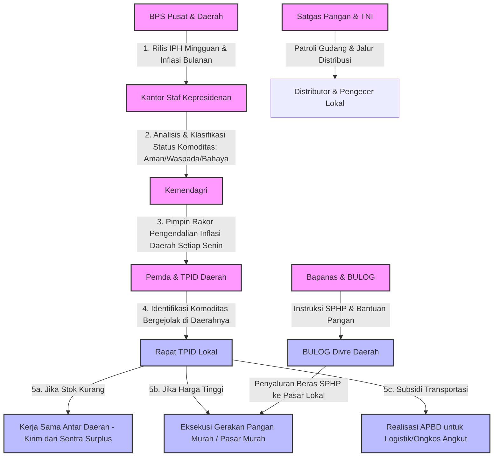
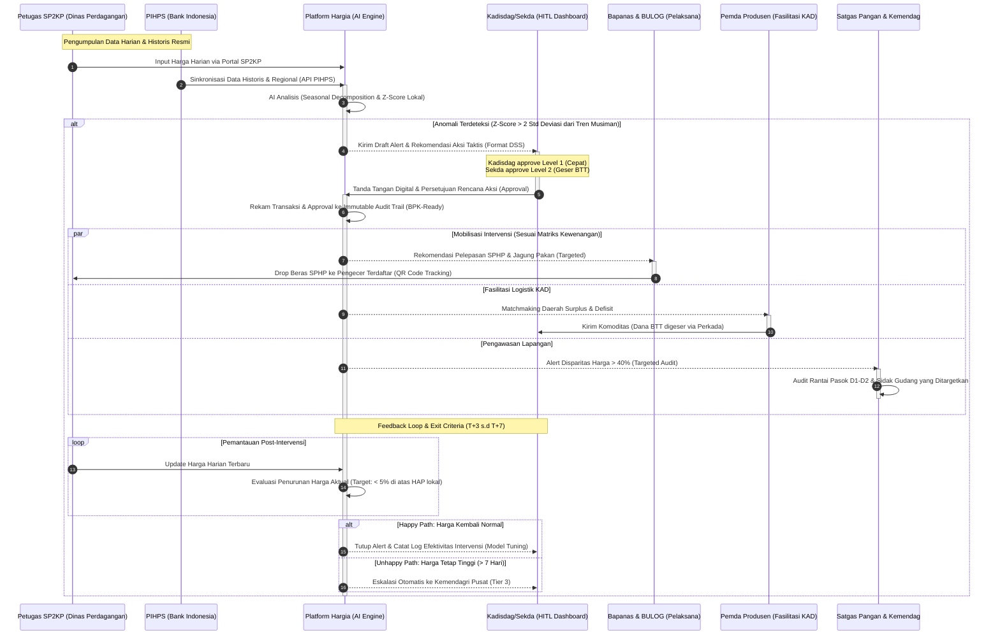
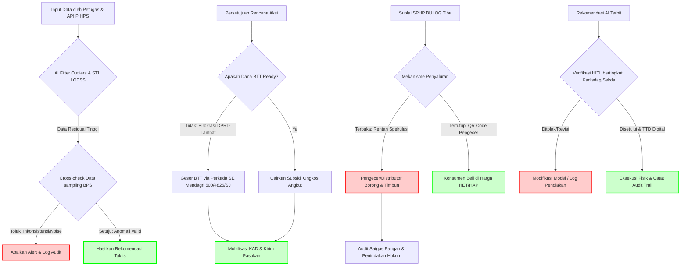

# Analisis Proses Bisnis Pengendalian Inflasi TPID & Platform Hargia

> Dokumen komprehensif ini mengevaluasi kelemahan logis dan operasional dari proses bisnis saat ini (*As-Is*), memetakan celah sistemik (*Gap Analysis*) berdasarkan data riil tata kelola TPID Indonesia (2024–2025), serta merumuskan proses bisnis masa depan (*To-Be*) yang ideal dengan mitigasi jalur kegagalan (*unhappy path*) berbasis *best practice* internasional dan regulasi nasional.

---

## Konteks: Kondisi Ekosistem TPID Saat Ini (2024–2025)

Sebelum mengimplementasikan platform Hargia, penting untuk memahami kondisi nyata sistem pengendalian inflasi daerah yang berjalan saat ini agar terhindar dari konflik duplikasi data atau resistensi institusional:

- **Inflasi Nasional Terkendali**: Tercatat stabil di angka 1,57% (yoy) sepanjang 2024 dan berada pada tingkat 2,86% per Oktober 2025 (masuk dalam target sasaran pemerintah 2,5±1%). Ini menunjukkan sistem TPID saat ini memiliki landasan fungsi yang berjalan dengan baik.
- **SP2KP Kemendag (Sistem Pemantauan Pasar Kebutuhan Pokok)**: Telah menjangkau 487 dari 514 kabupaten/kota (95%). Pengisian dilakukan secara terstruktur oleh kontributor petugas pemerintah daerah (Dinas Perdagangan), bukan pedagang langsung, setiap hari Senin–Jumat pukul 08.00–10.00 waktu setempat melalui portal `sp2kp.kemendag.go.id`.
- **PIHPS Bank Indonesia (Pusat Informasi Harga Pangan Strategis)**: Menyediakan data harga pangan harian untuk 10 komoditas strategis di 82 kabupaten/kota sampel IHK secara real-time setiap hari kerja mulai pukul 10.00 WIB. PIHPS juga mengelola standar deviasi historis harga per provinsi.
- **Kolaborasi BPS & Kemendag**: Pada November 2025, BPS dan Kemendag menandatangani perjanjian kerja sama resmi untuk mengintegrasikan data harga eceran SP2KP sebagai dasar penghitungan Indeks Perkembangan Harga (IPH) mingguan.

---

## 1. Pemangku Kepentingan (Stakeholders) & Peran

| Instansi / Pemangku Kepentingan | Peran Utama dalam Pengendalian Inflasi |
| :--- | :--- |
| **Kementerian Dalam Negeri (Kemendagri)** | Memimpin Rapat Koordinasi (Rakor) Pengendalian Inflasi setiap hari Senin. Memantau realisasi APBD daerah (anggaran Belanja Tidak Terduga/BTT) untuk intervensi harga dan menilai kinerja inflasi Kepala Daerah. |
| **Badan Pusat Statistik (BPS)** | Menyediakan data inflasi bulanan (*Year-on-Year*, *Month-to-Month*) serta Indeks Perkembangan Harga (IPH) mingguan per Kabupaten/Kota sebagai basis utama analisis situasi harga. |
| **Badan Pangan Nasional (Bapanas)** | Menetapkan batas atas/bawah Harga Eceran Tertinggi (HET) dan Harga Acuan Penjualan (HAP). Mengoordinasikan program bantuan pangan (Banpang) serta mengelola cadangan pangan pemerintah. |
| **Perum BULOG** | Mengeksekusi penyaluran cadangan pangan di daerah, mendistribusikan beras murah melalui program Stabilisasi Pasokan dan Harga Pangan (SPHP), serta jagung pakan murah ke peternakan. |
| **Kantor Staf Kepresidenan (KSP)** | Memantau disparitas harga strategis nasional, menyusun klasterisasi status komoditas (Aman, Waspada, Tidak Aman), dan merumuskan rekomendasi kebijakan taktis untuk Presiden. |
| **Kementerian Pertanian (Kementan)** | Menjaga stabilitas di tingkat produsen (petani/peternak), menyusun peta panen/produksi mingguan, serta memfasilitasi logistik benih, pupuk, dan pompa air di musim kemarau. |
| **Kementerian Perdagangan (Kemendag)** | Mengawasi kelancaran rantai pasok barang kebutuhan pokok di hilir, mengelola DMO minyak goreng (Minyakita), dan melakukan audit terhadap distributor/sub-distributor. |
| **Satgas Pangan Polri & TNI** | Melakukan penegakan hukum dan pengawasan fisik di lapangan; mendeteksi penimbunan, mengawal jalur distribusi dari gangguan keamanan, dan mengawasi gudang-gudang logistik. |
| **Pemda & TPID Daerah** | Dipimpin oleh Kepala Daerah (Gubernur/Bupati/Walikota) bersama dinas teknis setempat. Bertanggung jawab langsung mengeksekusi operasi pasar, Gerakan Pangan Murah (GPM), subsidi ongkos angkut, dan Kerja Sama Antar Daerah (KAD). Sekretaris Daerah (Sekda) menjabat sebagai Ketua TAPD yang mengendalikan anggaran daerah. |

---

## 2. Peta Proses Bisnis Saat Ini (*As-Is*)

Proses bisnis saat ini didasarkan pada siklus mingguan reaktif yang bertumpu pada rilis IPH BPS.

---

## 3. Gap Analysis: Kelemahan Sistemik Proses Bisnis & Platform

### Gap 1 — Kesalahpahaman Sumber Data SP2KP
*   **Masalah**: Asumsi awal proses bisnis menggambarkan data SP2KP berasal dari pengisian langsung oleh pedagang pasar (*crowd-sourcing*). Secara faktual, data SP2KP dimasukkan secara manual oleh **petugas Dinas Perdagangan daerah**.
*   **Implikasi**: Mitigasi risiko manipulasi data pedagang menjadi tidak relevan. Celah sebenarnya adalah inkonsistensi pelaporan petugas daerah, perbedaan standar pencatatan, dan keterlambatan pelaporan di daerah terpencil.
*   **Rekomendasi**: Posisikan Hargia sebagai agregator resmi data SP2KP melalui jalur integrasi API formal dengan Kemendag (mengikuti preseden MoU BPS–Kemendag November 2025). Jika ingin menambah data dari pedagang, buat modul masukan tambahan terpisah melalui bot komunikasi ringan seperti WhatsApp Business API.

### Gap 2 — Threshold Anomali Statis Tanpa Faktor Musiman & Konteks Lokal
*   **Masalah**: Penentuan alarm merah hanya berbasis persentase statis (`> 10% di atas HAP selama 3 hari berturut-turut`). Pendekatan ini mengabaikan inflasi musiman tahunan (Lebaran, Natal) dan variasi ongkos logistik logis di setiap daerah.
*   **Implikasi & Risiko Over-Intervensi (*Boncos*)**: 
    - Kenaikan harga cabai menjelang Lebaran adalah pola normal (struktural). Menggunakan threshold statis HAP nasional akan memicu alarm palsu (*false positive*) yang masif di daerah terpencil.
    - **Bukti Statistik Historis**: Analisis data transaksi eceran nasional (447.799 records) menunjukkan bahwa dari seluruh kasus lonjakan harga cepat ($\ge 20\%$ dalam 1 hari), sebesar **67,87% mengalami koreksi mandiri (*self-corrected*)** turun kembali ($\ge 15\%$) dalam waktu 2–4 hari berikutnya tanpa adanya intervensi pemerintah. 
    - Meluncurkan anggaran subsidi ongkos angkut (misal: BTT Rp 3.500.000) pada hari ke-1 atau ke-2 lonjakan berisiko tinggi menyebabkan pemborosan anggaran (*boncos*), karena saat pasokan tiba, harga pasar secara alami sudah kembali stabil. Selain itu, kelebihan pasokan di pasar yang sudah stabil akan menjatuhkan harga produsen dan merugikan pedagang lokal.
*   **Rekomendasi**: 
    1. Terapkan model *Seasonal Decomposition* (misal: STL LOESS) untuk menyaring fluktuasi normal hari raya dari anomali spekulatif.
    2. Sesuaikan threshold Z-Score secara dinamis berbasis volatilitas komoditas (Z-Score $> 2.5$ untuk cabai/bawang yang sangat volatil; Z-Score $> 1.5$ untuk beras/gula yang stabil).
    3. Terapkan filter kualitas data: jika kenaikan harga dibarengi dengan penurunan drastis pelaporan sampel (`jumlah_pedagang` reporting), klasifikasikan sebagai *sample noise*, bukan defisit pasokan riil.

### Gap 3 — Tidak Ada *Authority Matrix* yang Jelas
*   **Masalah**: Notifikasi anomali dikirimkan secara serentak ke TPID, BULOG, dan Satgas Pangan tanpa hirarki komando dan wewenang keputusan yang matang.
*   **Implikasi**: Birokrasi daerah lambat bertindak karena saling menunggu persetujuan, atau terjadi benturan kebijakan di lapangan (misalnya Satgas melakukan sidak represif saat TPID sedang menegosiasikan Kerja Sama Antar Daerah/KAD).
*   **Rekomendasi**: Formalkan matriks kewenangan dalam nota kesepahaman (MOU) antar instansi, menetapkan *lead actor* per jenis anomali secara eksplisit melalui tabel kewenangan berikut:

| Jenis Alert | *Lead Actor* | *Supporting Actor* | Batas Waktu Respons |
|---|---|---|---|
| Lonjakan harga > threshold | TPID Daerah | BULOG Divre | 24 jam |
| Disparitas harga produsen-konsumen > 40% | Satgas Pangan | Kemendag | 48 jam |
| Defisit stok lintas daerah | TPID + KAD | Bapanas | 72 jam |
| Kelangkaan nasional | Bapanas | BULOG Pusat + Kemendag | Eskalasi langsung |

### Gap 4 — Ketiadaan *Feedback Loop* Pasca-Intervensi
*   **Masalah**: Alur proses berhenti ketika operasi pasar atau bantuan pangan diluncurkan tanpa adanya metrik pengukuran efektivitas pasca-tindakan.
*   **Implikasi**: Kasus di TPID Denpasar 2024 membuktikan bahwa tanpa integrasi digital pasca-intervensi, pemerintah daerah kesulitan mempertanggungjawabkan alokasi anggaran BTT ke DPRD dan sistem AI tidak dapat belajar dari data keberhasilan/kegagalan tindakan.
*   **Rekomendasi**: 
    1. **Masa Tunggu / Cooldown Period (3 Hari)**: Sebelum alert intervensi resmi dipicu ke penentu kebijakan, berlakukan masa tunggu selama 3 hari sejak anomali terdeteksi guna memfilter 68% fluktuasi jangka pendek yang dapat menyelesaikan diri secara alami.
    2. **Exit Criteria Otomatis**: Terapkan *exit criteria* otomatis langsung pada modul monitoring platform. Status alert diturunkan dari "Merah" menjadi "Normal" (Exit) hanya jika harga rata-rata riil harian turun ke `< 5% di atas HAP lokal` selama 3 hari berturut-turut dalam rentang SLA 7 hari setelah intervensi. Jika kriteria tidak terpenuhi, sistem secara otomatis memicu notifikasi eskalasi Level 2/3.

### Gap 5 — Tidak Ada Protokol Eskalasi SLA Bertingkat
*   **Masalah**: Sistem tidak memodelkan jalur mitigasi jika respons awal daerah gagal (misalnya pasokan SPHP habis atau daerah surplus menolak mengirimkan stok karena proteksionisme lokal).
*   **Implikasi**: Gejolak inflasi daerah berlangsung berlarut-larut tanpa mendapat eskalasi bantuan dari pemerintah pusat.
*   **Rekomendasi**: Buat protokol eskalasi 3-tingkat: Tier 1 (tindakan mandiri TPID daerah 1–3 hari), Tier 2 (aktivasi penuh SPHP BULOG & audit Satgas Pangan 3–7 hari), dan Tier 3 (eskalasi ke Kemendagri & Bapanas pusat untuk agenda Rakor inflasi mingguan nasional jika gejolak > 7 hari).

### Gap 6 — Ketergantungan API SP2KP Tanpa Kontrak Kerja Sama Resmi
*   **Masalah**: Arsitektur platform bertumpu pada teknik *scraping* harian. Di sisi lain, SP2KP Kemendag sedang mengalami transformasi integrasi resmi dengan BPS per November 2025.
*   **Implikasi**: Perubahan struktur data atau autentikasi internal di server Kemendag selama masa transformasi akan menyebabkan kegagalan ingestion data secara masif pada Hargia.
*   **Rekomendasi**: Bangun perjanjian kerja sama (MOU) formal untuk integrasi API resmi. Sediakan pipeline cadangan (*dual-source fallback*) dengan memanfaatkan API harga harian milik PIHPS Bank Indonesia yang stabil.

### Gap 7 — Pengabaian Data Historis PIHPS Bank Indonesia
*   **Masalah**: Perancangan database baseline historis diabaikan, padahal BI melalui PIHPS telah menyediakan data deret waktu harga 10 komoditas strategis terpilah sejak 2016 secara gratis.
*   **Implikasi**: Kesulitan menangani kasus pasar baru yang belum memiliki riwayat transaksi data (*cold-start*).
*   **Rekomendasi**: Jadikan data historis PIHPS BI (9+ tahun) sebagai acuan dasar (*baseline*) model prediksi AI, dan SP2KP sebagai pencatat transaksi harian lokal yang dinamis.

### Gap 8 — Asumsi Kapabilitas SDM ASN Daerah yang Kurang Realistis
*   **Masalah**: Menampilkan visualisasi data statistik yang kompleks untuk diinterpretasikan langsung oleh staf daerah.
*   **Implikasi**: Banyak dashboard daerah (seperti SIPAPA ONLINE Denpasar) tidak optimal akibat keterbatasan analisis data teknis dari ASN serta tingginya tingkat rotasi jabatan.
*   **Rekomendasi**: Ubah sistem visualisasi data murni menjadi *Action-Oriented Decision Support System* (DSS). Sistem harus menyajikan output analisis dalam bahasa taktis langsung: *"Bawang merah di Pasar C naik 15%. Rekomendasi: Kirim pasokan 3 ton dari Kabupaten Y dalam 48 jam dengan estimasi subsidi logistik APBD Rp 5 juta."*

### Gap 9 — Kekosongan Hukum Akuntabilitas Algoritma AI
*   **Masalah**: Rekomendasi AI yang memicu intervensi fisik (seperti sidak gudang distributor oleh Satgas) berisiko menimbulkan kerugian bisnis jika analisis AI ternyata keliru. Di Indonesia, belum ada UU AI yang mengatur tanggung jawab hukum algoritmik ini (*algorithmic accountability*).
*   **Implikasi**: Risiko tuntutan perdata dari pengusaha ke Pemda atau tuduhan penyalahgunaan wewenang administrasi publik oleh aparat penegak hukum.
*   **Rekomendasi**: Formalkan kebijakan *Human-in-the-Loop* (HITL) di mana sistem AI bertindak sebagai pemberi rekomendasi keputusan (*decision support*), bukan pengeksekusi otomatis. Desain HITL ini **konsisten dengan semangat nilai Kemanusiaan dan Akuntabilitas dalam SE Menkominfo No. 9/2023 tentang Etika Kecerdasan Artifisial** (sebagai panduan etika non-mengikat/soft law), sekaligus melindungi Pemda dari risiko yuridis pengambilan keputusan publik otomatis (*automated public policy decision-making*). Rekomendasi wajib disetujui secara bertahap oleh pejabat berwenang dengan penandatanganan digital dalam *immutable audit trail* untuk keperluan pemeriksaan BPK.

### Gap 10 — Hambatan Operasional Akibat Approval Tunggal Sekda (*Bottleneck Approval*)
*   **Masalah**: Menempatkan Sekretaris Daerah (Sekda) selaku Ketua TAPD sebagai satu-satunya pemberi persetujuan (*sole approver*) untuk seluruh tingkat rekomendasi intervensi harian berpotensi besar menimbulkan hambatan operasional (*bottleneck*).
*   **Implikasi**: Mengingat beban kerja Sekda yang sangat tinggi, perjalanan dinas, dan hari libur, alert intervensi taktis harian (seperti pasar murah skala mikro atau penambahan kuota eceran) bisa terlambat dieksekusi, sehingga harga keburu naik tak terkendali.
*   **Rekomendasi**: Terapkan mekanisme **Pendelegasian Kewenangan Bertingkat (*Delegation of Authority*)**:
  1. **Intervensi Level 1 (Taktis Harian)**: Hak persetujuan didelegasikan kepada Kepala Dinas Perdagangan (Kadisdag) selaku Sekretaris TPID untuk eksekusi cepat dalam waktu < 24 jam (misalnya operasi pasar skala mikro atau pembagian beras SPHP cadangan biasa).
  2. **Intervensi Level 2 & 3 (Strategis & Anggaran Besar)**: Persetujuan akhir tetap di tangan Sekda selaku Ketua TAPD (misalnya pergeseran BTT APBD skala besar atau inisiasi Kerja Sama Antar Daerah/KAD yang baru).

---

## 4. Rekomendasi Proses Bisnis Masa Depan (*To-Be*)

Proses bisnis *To-Be* mengubah pendekatan dari **reaktif-birokratis** menjadi **digital-preventif berbasis data real-time** dengan mengintegrasikan pengambilan keputusan yang akuntabel (*Human-in-the-Loop*), delegasi wewenang bertingkat untuk menghindari bottleneck, integrasi data multi-sumber resmi, dan lingkaran umpan balik (*feedback loop*) otomatis.

### Keunggulan Proses Bisnis *To-Be*:
1. **Deteksi Anomali Berbasis Musim**: AI Hargia menyaring fluktuasi normal hari raya menggunakan dekomposisi musiman STL LOESS dan membandingkan harga lokal dengan standar deviasi historis PIHPS BI, bukan threshold statis HAP nasional. Hal ini meminimalisir *false positives*.
2. **Pengambilan Keputusan Berbasis HITL (Human-in-the-Loop)**: Selaras dengan semangat nilai Kemanusiaan dan Akuntabilitas dalam **SE Menkominfo No. 9/2023** (sebagai panduan etika tidak mengikat/soft law), keputusan intervensi tidak dieksekusi secara otomatis oleh AI, melainkan melewati tinjauan pejabat berwenang secara bertahap demi akuntabilitas kebijakan publik.
3. **Delegasi Wewenang Bebas Bottleneck**: Untuk menghindari kelambatan akibat kesibukan Sekda, persetujuan intervensi taktis harian (Level 1) didelegasikan kepada Kepala Dinas Perdagangan (Kadisdag). Sekda hanya memegang kendali persetujuan untuk intervensi strategis (Level 2/3) yang membutuhkan realisasi anggaran APBD/BTT.
4. **Akuntabilitas Hukum & Audit Trail**: Setiap persetujuan digital pejabat TPID, data input AI, dan log tindakan terekam dalam *immutable audit trail* yang siap diaudit oleh BPK (Badan Pemeriksa Keuangan) untuk menghindari risiko penyalahgunaan wewenang.
5. **Intervensi Logistik Instan**: Memanfaatkan dasar hukum **SE Mendagri No. 500/4825/SJ** dan **Permendagri No. 77/2020**, Pemda dapat langsung melakukan pergeseran anggaran Belanja Tidak Terduga (BTT) melalui perubahan Perkada tanpa hambatan birokrasi persetujuan DPRD.
6. **Pelacakan Distribusi Tertutup**: Distribusi beras SPHP oleh BULOG dilakukan secara tertutup dengan penelusuran digital (QR Code) hingga tingkat pengecer, menghindari penimbunan oleh distributor tingkat menengah.
7. **Siklus Evaluasi (Feedback Loop) & Exit Criteria**: Platform secara otomatis memantau efektivitas operasi pasar selama periode T+3 hingga T+7. Status alert diturunkan dari "Merah" menjadi "Normal" (Exit) hanya jika harga rata-rata riil harian turun ke `< 5% di atas HAP lokal` selama 3 hari berturut-turut. Jika harga gagal turun, eskalasi bertingkat ke tingkat kementerian pusat secara otomatis dipicu.

---

## 5. Studi Kasus Internasional & Best Practices

Dalam menyusun mitigasi risiko intervensi harga, kita dapat mengambil pembelajaran dari keberhasilan negara lain:

### A. Korea Selatan: *Proactive Supply Control & Area Management*
*   **Cultivation Area Management**: Pemerintah Korea Selatan mengendalikan pasokan dari hulu dengan menetapkan area budi daya per wilayah. Jika petani menanam melebihi kuota kesepakatan, mereka kehilangan hak atas asuransi harga (*Agricultural Income Stability Insurance*). Hal ini mencegah kelebihan produksi (*glut*) yang merusak harga produsen.
*   **Digitization of Wholesale**: Transisi ke sistem pasar grosir online mempersingkat rantai pasok, mengurangi biaya perantara, dan memotong waktu distribusi dari perkebunan langsung ke retail.

### B. India: *Price Stabilization Fund (PSF) & Buffer Stock Operations*
*   **Dana Taktis Terpusat (PSF)**: India membentuk dana khusus (*corpus fund*) untuk stabilisasi harga komoditas hortikultura esensial (seperti bawang, kentang, pulsa). Dana ini memberikan pinjaman modal kerja bebas bunga kepada negara bagian/daerah untuk melakukan intervensi pasar secara cepat tanpa hambatan birokrasi anggaran tahunan.
*   **Calibrated Release**: Pengadaan dilakukan langsung dari petani saat panen melimpah (mencegah kejatuhan harga produsen), lalu stok buffer dilepaskan secara bertahap saat terjadi lonjakan harga ritel untuk meredam spekulasi.

---

## 6. Peta Mitigasi Risiko & Penanganan *Unhappy Path*

Berdasarkan analisis celah dan pembelajaran internasional, berikut adalah matriks mitigasi operasional untuk menjaga keandalan sistem saat terjadi kendala (*unhappy path*):

| Skenario Kegagalan (*Unhappy Path*) | Dampak Risiko | Tindakan Mitigasi (*Best Practice*) | Aktor Penanggung Jawab |
| :--- | :--- | :--- | :--- |
| **A. Manipulasi Data / False Anomalies** Petugas daerah terlambat menginput data atau data terdistorsi akibat perbedaan standar. | Pemborosan anggaran intervensi untuk wilayah yang sebenarnya stabil. | **AI Outlier Filter & BPS Verification**: 1. AI Hargia menyaring data pencilan menggunakan algoritma *IQR (Interquartile Range)*. 2. Sistem melakukan *cross-check* otomatis dengan data sampling resmi BPS daerah sebelum mengeluarkan alarm merah. 3. Kepatuhan penuh terhadap **UU PDP No. 27/2022** dalam pengolahan data identitas pedagang pasar. | BPS & Tim AI Hargia |
| **B. Hambatan Anggaran Daerah (BTT APBD Lambat)** Persetujuan administrasi Belanja Tidak Terduga (BTT) untuk subsidi ongkos angkut logistik memakan waktu berhari-hari. | Harga keburu melonjak tak terkendali di pasar lokal akibat pasokan tertahan. | **BTT Shift via Perkada (Adopsi SE Mendagri No. 500/4825/SJ)**: 1. Menggunakan mekanisme pergeseran anggaran BTT untuk keperluan mendesak berdasarkan **Permendagri No. 77/2020**. 2. Pencairan dana dilakukan langsung oleh Kepala Daerah melalui perubahan Perkada (Peraturan Kepala Daerah) tentang penjabaran APBD tanpa harus menunggu persetujuan DPRD (APBD Perubahan) agar intervensi berjalan instan. | Pemda & Dirjen Keuda Kemendagri |
| **C. Penolakan / Spekulasi Distributor Lokal** Distributor besar lokal memborong barang intervensi murah (seperti SPHP BULOG) untuk ditimbun atau dijual kembali dengan harga mahal. | Manfaat intervensi tidak sampai ke konsumen akhir. | **Penyaluran Tertutup & Digital Tracking (Adopsi Korea Online Wholesale)**: 1. Penjualan komoditas subsidi wajib disalurkan langsung ke pengecer terdaftar dengan kuota harian maksimum. 2. Pelacakan stok real-time dari gudang BULOG hingga lapak pengecer menggunakan QR Code / nota transaksi digital di platform Hargia. | BULOG, Kemendag & Satgas Pangan |
| **D. Kelangkaan Pasokan Nasional** Tidak ada daerah produsen yang memiliki surplus karena bencana El Nino/gagal panen masal nasional. | Kerja Sama Antar Daerah (KAD) tidak bisa dijalankan. | **Strategic Import & Buffer Stock Release**: 1. Bapanas segera merekomendasikan pembukaan keran impor secara terukur. 2. BULOG melepas cadangan pangan nasional dari gudang penyimpanan strategis untuk meredam gejolak dalam negeri. | Bapanas, BULOG & Kemendag |
| **E. Akuntabilitas Hukum & Bottleneck Operasional** Kesalahan rekomendasi AI mengakibatkan kerugian material pada pelaku usaha/Pemda, atau birokrasi macet menunggu tanda tangan Sekda. | Risiko tuntutan hukum ganti rugi, penolakan politik, dan lambatnya aksi respons harian di lapangan. | **Human-in-the-Loop bertingkat & Audit Trail (Prinsip Selaras SE Menkominfo No. 9/2023)**: 1. Penerapan nilai *Kemanusiaan* dan *Akuntabilitas* selaras dengan SE Menkominfo 9/2023: AI didesain sebagai pendukung keputusan (decision support) tanpa eksekusi otomatis. 2. Keputusan intervensi ditandatangani secara digital dengan sistem bertingkat: Kadisdag (Level 1) atau Sekda (Level 2/3) via aplikasi dashboard. 3. Setiap log keputusan dan data pendukung AI dicatat pada *immutable audit trail* untuk keperluan pemeriksaan BPK. | Kadisdag (Level 1), Sekda selaku Ketua TAPD (Level 2/3) & Tim Legal Pemda |

### Alur Logika Mitigasi Kegagalan

---

## 7. Strategi Implementasi Platform Open-Source & Integrasi Satu Data Indonesia (SDI)

Mengingat platform Hargia dikembangkan sebagai aplikasi *open-source* (tanpa skema kontrak komersial/SaaS vendor), terdapat strategi khusus untuk meminimalkan friksi pengadaan, anggaran, institusional, dan teknis operasional di tingkat daerah (khususnya tingkat Kabupaten/Kota):

### A. Bypass Friksi Pengadaan & Anggaran via Inovasi Kolaborasi
*   **Mekanisme**: Platform Hargia tidak didorong melalui jalur tender LPSE atau e-Katalog. Sebaliknya, aplikasi ini di-deploy secara mandiri (*self-hosted*) menggunakan infrastruktur VPS/Server lokal milik **Dinas Kominfo** yang umumnya sudah dianggarkan per tahun untuk menampung aplikasi pelayanan publik.
*   **Framing Kegiatan**: Proyek didefinisikan sebagai **"Inovasi Kolaborasi Non-Komersial antara BPS Kabupaten/Kota dengan Pemerintah Daerah"**. Framing ini sangat disukai oleh Pemda karena langsung menaikkan penilaian Indeks Reformasi Birokrasi (RB) dan berkontribusi pada poin *Innovative Government Award (IGA)* Kemendagri tanpa membebani keuangan daerah.

### B. Mengatasi Ego Sektoral Melalui Payung Hukum Satu Data Indonesia (SDI)
*   **Mekanisme**: Penyelarasan integrasi data lintas instansi (SP2KP Dinas Perdagangan, sampling BPS, data stok BULOG) dilakukan dengan menunggangi program kerja **Satu Data Indonesia Tingkat Daerah (Perpres No. 39/2019)**:
    1.  **BPS Daerah** bertindak sebagai **Pembina Data** yang memberikan rekomendasi metodologis standardisasi data harga dan integrasi database historis PIHPS.
    2.  **Dinas Kominfo** bertindak sebagai **Wali Data** yang meng-host platform Hargia dan mengelola aksesnya.
    3.  **Dinas Perdagangan** bertindak sebagai **Produsen Data** yang memelihara aliran transaksi harian SP2KP.
*   **Implikasi**: Penggunaan forum formal SDI Daerah menghilangkan ego sektoral karena masing-masing instansi menjalankan tugas pokok dan fungsi (Tupoksi) resmi mereka dalam naungan regulasi nasional yang sudah ada.

### C. Solusi Konektivitas & Fleksibilitas Input Data Lapangan
*   **Mekanisme**: Petugas pasar di daerah terpencil sering kali menghadapi keterbatasan memori perangkat, kuota, atau sinyal seluler. Untuk mengatasi hal ini, platform didesain dengan opsi integrasi masukan dua jalur:
    1.  **Jalur Utama**: Penarikan data otomatis (*scraping*) langsung dari database SP2KP pusat tanpa memerlukan aktivitas pengisian ganda (*double-entry*) oleh petugas.
    2.  **Jalur Cadangan (Supplementary)**: Menggunakan integrasi **WhatsApp / Telegram Bot API** yang terhubung dengan API Server Hargia. Petugas di lapangan cukup mengirimkan pesan teks dengan format ringkas yang ramah sinyal 3G (contoh: `/input pasar_mempawah cabai_rawit 45000`) untuk meng-update harga komoditas lokal secara instan.

---

## Referensi

- BPS & Kemendag, *Kerja sama penyediaan statistik harga BPS–Kemendag untuk proxy inflasi*, November 2025. [bps.go.id]
- Bank Indonesia, *Pusat Informasi Harga Pangan Strategis (PIHPS) Nasional*, diakses Juni 2026. [bi.go.id/hargapangan]
- Kemendag, *Refreshment SP2KP — Presentasi Monitoring & Evaluasi Maluku*, [slideshare.net]
- Kemenko Perekonomian, *Pengendalian Inflasi dan Digitalisasi Keuangan Daerah*, November 2025. [ekon.go.id]
- MALCOM Journal, *Multi-Commodity Food Price Forecasting Ahead of Eid Al-Fitr in Indonesia (2026–2030)*, Februari 2026.
- ijespg Journal, *Evaluasi Program Pengendalian Inflasi Melalui TPID Kota Denpasar Tahun 2024*.
- Fortiori Law Journal, *The Revolution of Public Administration in the Era of AI: Legal Challenges*, 2025.
- WFP, *Alert for Price Spikes (ALPS) Indicator Methodology*, dikutip dalam Busker et al. (2024), Earth's Future.
- Santika et al. (2025), *Kecerdasan Buatan dan Hak Asasi Manusia*, jurnal hukum Appisi.
- Kementerian Dalam Negeri, *Surat Edaran Nomor 500/4825/SJ tentang Penggunaan Belanja Tidak Terduga untuk Pengendalian Inflasi di Daerah*, 2022.
- Kementerian Dalam Negeri, *Peraturan Menteri Dalam Negeri Nomor 77 Tahun 2020 tentang Pedoman Teknis Pengelolaan Keuangan Daerah*.
- Kementerian Komunikasi dan Informatika, *Surat Edaran Menteri Komunikasi dan Informatika Nomor 9 Tahun 2023 tentang Etika Kecerdasan Artifisial*.
- Republik Indonesia, *Undang-Undang Nomor 27 Tahun 2022 tentang Pelindungan Data Pribadi*.
